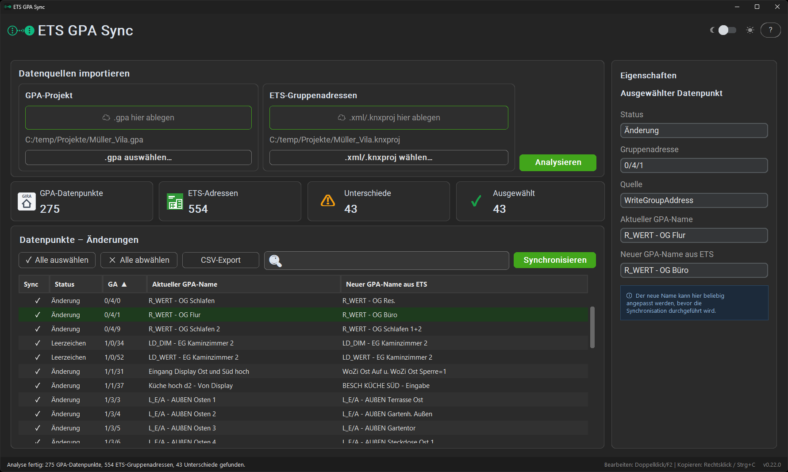

# ETS GPA Sync

> Synchronisiere Gruppenadressen-Namen zwischen **KNX ETS** und **Gira GPA** — schnell, sicher, kostenlos.

[](https://opensource.org/licenses/MIT)
[](https://www.python.org/)
[](#)
[](#)

---

## 🚧 Status: In aktiver Entwicklung

Dieses Projekt befindet sich in aktiver Entwicklung. Eine erste Beta-Version (**v0.9.0-beta**) ist als Windows-`.exe` verfügbar. Die erste stabile Version (**v1.0.0**) mit Code-Signing ist in Vorbereitung.

---

## ⭐ Was macht dieses Tool?

Wer KNX-Projekte mit der **ETS** plant und parallel die **Gira GPA** für Visualisierung nutzt, kennt das Problem: Gruppenadressen-Namen müssen in beiden Tools **manuell synchron gehalten werden**. Eine Änderung in der ETS bedeutet stundenlanges Nachpflegen in der GPA — oder umgekehrt.

**ETS GPA Sync** automatisiert genau diesen Abgleich:

- 📥 **Beide Quellen einlesen** — `.gpa`-Datei (Gira GPA) und `.xml` / `.knxproj` (ETS)
- 🔍 **Unterschiede erkennen** — übersichtliche Anzeige aller Abweichungen
- ✏️ **Selektiv übernehmen** — du entscheidest pro Gruppenadresse
- 💾 **Sicher schreiben** — Originaldateien werden geschützt, Backups inklusive

> *"Was vorher Stunden gedauert hat, geht jetzt in Minuten."*

---

## ✨ Hauptfunktionen

- ✅ **Drag & Drop** für `.gpa` und ETS-Exporte (`.xml` / `.knxproj`)
- ✅ **Tabellarischer Vergleich** mit Filter- und Suchfunktion
- ✅ **Selektive Synchronisation** — pro Gruppenadresse einzeln entscheiden
- ✅ **Dark & Light Mode** mit anpassbaren Schriftgrößen (für hohe DPI)
- ✅ **CSV-Export** für Dokumentation und Audit

---

## 📸 Screenshots

> *Screenshots werden in Kürze ergänzt.*

<!-- Sobald Screenshots verfügbar:


-->

---

## 📥 Download

**[⬇️ ETS GPA Sync v0.9.0-beta herunterladen](https://github.com/EugHel/ets-gpa-sync/releases/latest)**

ZIP entpacken → `ETS-GPA-Sync.exe` starten. Kein Python erforderlich.
Getestet auf Windows 10 und 11.

> ⚠️ Beta-Version — bitte vor der Synchronisation Sicherheitskopien
> erstellen.

---

## 🚀 Quick Start

1. **Tool herunterladen** — [ETS GPA Sync v0.9.0-beta](https://github.com/EugHel/ets-gpa-sync/releases/latest) → ZIP entpacken → .exe starten
2. **GPA-Projekt einfügen** — `.gpa`-Datei per Drag & Drop oder Button
3. **ETS-Export einfügen** — `.xml` oder `.knxproj` einfügen
4. **"Analysieren"** klicken — Unterschiede werden angezeigt
5. **Gewünschte Änderungen auswählen** und **"Synchronisieren"**

Fertig. Die `.gpa`-Datei enthält jetzt die neuen Namen aus der ETS.

> 💡 **Tipp:** Erstelle vor jeder Synchronisation eine Sicherheitskopie deiner Projekte.

---

## 💖 Unterstütze das Projekt

Dieses Tool ist **kostenlos und Open Source**. Wenn es dir hilft, freue ich mich über deine Unterstützung:

- 💼 [**GitHub Sponsors**](https://github.com/sponsors/EugHel) *(Einrichtung läuft)*
- ☕ [**Ko-fi**](https://ko-fi.com/eughel) — einmalige Unterstützung mit einem Kaffee

Jede Spende hilft, das Tool aktiv weiterzuentwickeln und **kostenlos für die KNX-Community** verfügbar zu halten.

---

## 🛠️ Für Entwickler

### Voraussetzungen
- **Python 3.13 oder neuer (entwickelt mit 3.14)**
- **Windows** (Hauptplattform — macOS/Linux experimentell)

### Installation aus dem Quellcode

```bash
git clone https://github.com/EugHel/ets-gpa-sync.git
cd ets-gpa-sync
pip install -r requirements.txt
python main.py
```

### Tests ausführen

```bash
pytest tests/
```

### DPI-Anpassung (optional)

Bei sehr hoher Windows-Skalierung (175-200%) kann der globale Schrift-Faktor angepasst werden:

```python
# In gpa_ga_sync/config.py
UI_SCALE_FACTOR = 0.85   # Standard: 1.0
```

---

## 🗺️ Roadmap

Siehe [ROADMAP.md](ROADMAP.md) für geplante Features und Versionspläne.

## 📜 Changelog

Siehe [CHANGELOG.md](CHANGELOG.md) für die Versionshistorie.

---

## 🤝 Beiträge

Beiträge sind willkommen! Bitte erstelle zuerst ein [Issue](https://github.com/EugHel/ets-gpa-sync/issues/new), bevor du größere Pull Requests einreichst.

## 🔒 Sicherheit

Sicherheitslücken bitte gemäß [SECURITY.md](SECURITY.md) melden — **nicht** als öffentliches Issue.

## 📜 Lizenz

**MIT License** — siehe [LICENSE](LICENSE) für Details.

---

## ⚠️ Disclaimer

Dieses Tool wird **ohne Gewährleistung** bereitgestellt. Erstelle vor jeder Synchronisation eine **Sicherheitskopie** deiner Projekte. Die Autoren übernehmen **keine Haftung** für Datenverlust oder Projektschäden.

---

## 📞 Kontakt

- **Issues & Feature-Requests**: [GitHub Issues](https://github.com/EugHel/ets-gpa-sync/issues)
- **Sicherheitsthemen**: siehe [SECURITY.md](SECURITY.md)

---

*Made with ❤ for the KNX community by [@EugHel](https://github.com/EugHel)*
