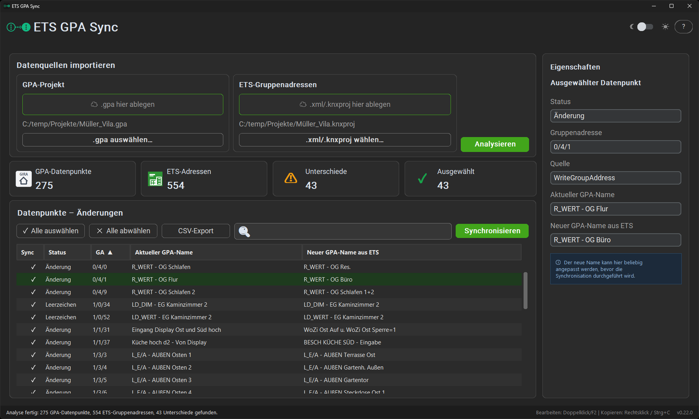

# ETS GPA Sync

> Synchronisiere Gruppenadressen-Namen zwischen **KNX ETS** und **Gira GPA** — und sieh auf einen
> Blick, wo jeder Datenpunkt im GPA-Projekt verwendet wird. Schnell, sicher, kostenlos.

[](https://opensource.org/licenses/MIT)
[](https://www.python.org/)
[](#)
[](#)

<div align="center">

### 💖 Unterstütze das Projekt

[](https://ko-fi.com/eughel)
&nbsp;&nbsp;
[](https://github.com/sponsors/EugHel)

*Dieses Tool ist kostenlos. Jede Unterstützung hilft, es aktiv weiterzuentwickeln!*

</div>

---

## 🚧 Status: Beta

Die aktuelle Beta-Version (**v0.10.0-beta**) ist als Windows-`.exe` verfügbar. Die erste stabile Version (**v1.0.0**) ist in Vorbereitung.

---

## ⭐ Was macht dieses Tool?

Wer KNX-Projekte mit der **ETS** plant und parallel die **Gira GPA** nutzt, kennt das Problem: Gruppenadressen-Namen müssen manuell synchron gehalten werden. Eine Änderung in der ETS bedeutet aufwendiges Nachpflegen in der GPA.

**ETS GPA Sync** automatisiert genau diesen Abgleich — du entscheidest pro Gruppenadresse, was übernommen wird. Das Original bleibt immer unverändert.

Außerdem zeigt es, **wo jeder Datenpunkt im GPA-Projekt verwendet wird** — in Visu-Ansichten (mit Raum), in der Logik und in Zeitschaltuhren. Die GPA selbst bietet diese Übersicht nicht. So findest du auch Datenpunkte, die nirgends mehr verwendet werden.

---

## ✨ Hauptfunktionen

- ✅ **Drag & Drop** für `.gpa` und ETS-Dateien (`.xml`-Export / `.knxproj`)
- ✅ **Passwortgeschützte ETS-Projekte** und verschlüsselte GPA-Archive werden unterstützt
- ✅ **Tabellarischer Vergleich** mit Suche und Filtern per Klick auf die Kennzahlen
- ✅ **Selektive Synchronisation** — pro Gruppenadresse einzeln entscheiden
- ✅ **Dark & Light Mode** mit anpassbaren Schriftgrößen
- ✅ **GPA-Prüfansicht** — nur die `.gpa` laden: wo wird jeder Datenpunkt verwendet?
  Visu-Ansichten (mit Raum und Benutzern), Logikeditor und Zeitschaltuhren; Filter für
  ungenutzte Datenpunkte
- ✅ **Auswirkungsprüfung** vor dem Synchronisieren
- ✅ **CSV-Export** für Dokumentation und Audit (inkl. Verweise)

---

## 📸 Screenshots



---

## 📥 Download

**[⬇️ ETS GPA Sync herunterladen (neueste Version)](https://github.com/EugHel/ets-gpa-sync/releases/latest)**

ZIP entpacken → `ETS-GPA-Sync.exe` starten. Kein Python erforderlich.
Getestet auf Windows 10 und 11.

> ⚠️ Beta — bitte vor der Synchronisation Sicherheitskopien erstellen.

---

## 🚀 Quick Start

1. **Herunterladen** → ZIP entpacken → `.exe` starten
2. **GPA-Projekt** ins linke Feld ziehen (oder das Feld anklicken)

**Nur prüfen:** „Analysieren“ klicken — die Tabelle zeigt alle Datenpunkte mit Raum und
Verwendungen. Am Projekt wird nichts verändert.

**Namen aus der ETS übernehmen:**

3. **ETS-Datei** (`.xml`-Export oder `.knxproj`) ins rechte Feld ziehen
4. **„Analysieren“** klicken und die Änderungen prüfen
5. **„Synchronisieren“** — es entsteht eine neue `.gpa`-Datei, das Original bleibt unverändert.

---

## 🛠️ Für Entwickler

```bash
git clone https://github.com/EugHel/ets-gpa-sync.git
cd ets-gpa-sync
pip install -r requirements.txt
python main.py
```

```bash
pytest tests/
```

Python 3.13 oder neuer erforderlich (entwickelt mit 3.14).

---

## 📋 Weiteres

| | |
|---|---|
| 🗺️ Roadmap | [ROADMAP.md](ROADMAP.md) |
| 📜 Changelog | [CHANGELOG.md](CHANGELOG.md) |
| 🤝 Beiträge | Bitte zuerst ein [Issue](https://github.com/EugHel/ets-gpa-sync/issues/new) erstellen |
| 🔒 Sicherheit | Gemäß [SECURITY.md](SECURITY.md) melden |
| 📜 Lizenz | [MIT License](LICENSE) |

---

## ⚠️ Disclaimer

Dieses Tool wird ohne Gewährleistung bereitgestellt. Erstelle vor jeder Synchronisation eine Sicherheitskopie. Die Autoren übernehmen keine Haftung für Datenverlust.

---

*Made with ❤ for the KNX community by [@EugHel](https://github.com/EugHel)*
